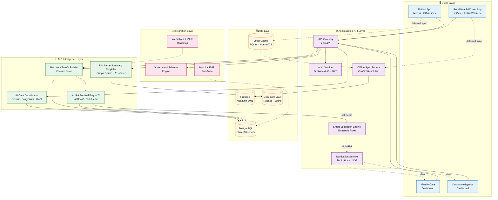

# AURA CareLink

<div align="center">

# AURA CareLink

### AI-Powered Continuity of Care Ecosystem for Rural & Remote Patients

**Powered by AURA Sentinel Engine™**

_Predictive Readmission & Early Relapse Intelligence_


**Team FusionX | Team Code: TETRA007**

_No patient should be forgotten after leaving the hospital._

<br />


_Complete platform overview — workflow, modules, features, architecture & tech stack_

</div>

---

## About the Project

AURA CareLink is an **AI-powered continuity of care platform** designed to support patients after hospital discharge, especially those living in **rural and remote communities** where follow-up care is limited.

The platform creates a **Recovery Twin™** for every discharged patient and continuously monitors recovery through medication adherence, symptom tracking, vitals, activity, and follow-up compliance. Using the **AURA Sentinel Engine™**, the system predicts **readmission and early relapse risk** before complications become critical, enabling timely intervention by doctors and caregivers.

Built during the **36-hour TetraTHON 2026 Indo-French Hackathon**, AURA CareLink aims to bridge the gap between hospitals and patients through **AI, machine learning, predictive analytics, and offline-first healthcare technology**.

---

# The Problem

Millions of patients experience complications after leaving the hospital because they:

- Forget to take medications
- Do not understand discharge instructions
- Miss follow-up appointments
- Lack access to doctors in rural areas
- Have no continuous recovery monitoring

These gaps often lead to **preventable hospital readmissions, delayed treatment, and increased healthcare costs**.

---

# Our Solution

AURA CareLink connects **patients, caregivers, doctors, hospitals, and rural health workers** through one intelligent platform.

The platform provides:

- AI-powered discharge summary simplification
- Recovery Twin™ digital health profile
- Predictive readmission risk analysis
- Smart escalation and emergency alerts
- Offline support for rural healthcare workers
- Multilingual AI healthcare assistance

---

# Platform Workflow

The end-to-end patient journey, as illustrated in the [platform overview](AURA%20Carelink%20workflow.jpeg) above:

| Step | Stage                          | What Happens                                                |
| ---- | ------------------------------ | ----------------------------------------------------------- |
| 1    | Hospital Discharge             | Patient is discharged with a medical summary                 |
| 2    | AI Discharge Summary Simplifier | Report converted into simple, multilingual instructions      |
| 3    | Recovery Profile Creation      | Patient health profile generated                             |
| 4    | Recovery Twin™ Dashboard       | Live digital recovery profile activated                      |
| 5    | Daily Monitoring & Check-ins   | Patient logs daily updates (offline supported)               |
| 6    | Data Collection                | Symptoms, medications, vitals, activity, follow-ups captured |
| 7    | AURA Sentinel Engine™          | AI/ML models analyse patterns across collected data          |
| 8    | Risk Prediction & Analysis     | Readmission risk, recovery score & relapse risk computed     |
| 9    | Smart Escalation Engine        | Risk classified as Low / Moderate / High                     |
| 10   | Alerts & Notifications         | Doctors and caregivers alerted on threshold breach           |
| 11   | Doctor / Caregiver Action      | Consultation, intervention or follow-up scheduled            |
| 12   | Continuous Recovery & Support  | Loop continues until full recovery                           |

---

# Core Innovations

## Recovery Twin™

A dynamic AI-generated recovery profile that evolves daily based on:

- Symptoms
- Medications
- Vitals
- Activity
- Follow-up compliance
- Recovery progress

---

## AURA Sentinel Engine™

The predictive intelligence engine that estimates:

- Readmission Probability
- Recovery Score
- Early Relapse Risk
- Patient Risk Level (Low / Moderate / High)

---

## AI Discharge Summary Simplifier

Transforms complex medical reports into simple, multilingual instructions patients can easily understand.

Example:

**Medical Report**

```text
Tab Metformin 500mg BID
```

**Patient-Friendly**

```text
Take one tablet after breakfast and one after dinner.
```

---

## Smart Escalation Engine

Automatically alerts doctors and caregivers when a patient's risk crosses a defined threshold.

**Example**

| Stage             | Detail                                                                   |
| ----------------- | ------------------------------------------------------------------------ |
| Signals detected  | Missed medication, fever, breathlessness, low activity, missed follow-up |
| Risk calculated   | Readmission Risk: **89%**                                                |
| Actions triggered | Doctor alerted → Caregiver notified → Emergency consultation recommended |

---

# Platform Modules

| Module                          | Purpose                                    |
| ------------------------------- | ------------------------------------------ |
| Recovery Twin™                  | Dynamic AI recovery profile                |
| AURA Sentinel Engine™           | Predictive readmission & relapse detection |
| Smart Escalation Engine         | Automatic high-risk escalation             |
| AI Care Coordinator             | 24×7 multilingual AI assistant             |
| AI Discharge Summary Simplifier | Simplifies medical reports                 |
| Family Care Dashboard           | Caregiver monitoring & alerts              |
| Doctor Intelligence Dashboard   | High-risk patient prioritization           |
| Rural Health Worker Module      | Offline healthcare support                 |
| Government Scheme Navigator     | Healthcare benefit assistance              |
| Offline-First Architecture      | Works without continuous internet          |

---

# Key Features

- Medication Tracker
- Symptom Tracker
- Appointment & Follow-up Manager
- Multilingual Voice Assistant
- Health Education & Recovery Guidance
- Emergency SOS Alerts
- Optional Vitals Monitoring
- Medical Report & Document Vault
- Offline Synchronization
- AI-Based Risk Prediction

---

# How AURA Sentinel Works

### Input Data

- Symptoms
- Medications
- Vitals
- Medical History
- Follow-up Compliance
- Lifestyle Indicators

### AI Processing

Machine learning models analyze patient patterns and generate:

- Recovery Score
- Readmission Risk
- Early Relapse Probability

### Example Prediction

```text
Patient: Female, 67
Diagnosis: Type-2 Diabetes + Hypertension

Recovery Score: 43%
Readmission Risk: 82%
Medication Adherence: 54%
Follow-up Missed: Yes

Status: HIGH RISK

Recommended Action:
Immediate doctor consultation within 24 hours
Notify caregiver
Schedule emergency follow-up
```

---

# Technology Stack

### Frontend

- Next.js
- React
- Tailwind CSS

### Backend

- FastAPI (Python)

### Database

- PostgreSQL
- Firebase

### AI & LLM

- Gemini API
- LangChain
- Retrieval-Augmented Generation (RAG)

### Machine Learning

- XGBoost
- Scikit-learn

### OCR

- Google Vision API
- Tesseract

### Authentication

- Firebase Authentication
- JWT

### Deployment

- Docker
- Render
- Vercel

---

# System Architecture

AURA CareLink follows a **five-layer, offline-first architecture**. Every client can operate without connectivity and reconciles with the cloud through a dedicated sync service.



### Layer Responsibilities

| Layer                    | Responsibility                                                       | Core Technologies                     |
| ------------------------ | -------------------------------------------------------------------- | ------------------------------------- |
| **Client**               | Patient, caregiver, doctor and health-worker interfaces; offline capture | Next.js, React, Tailwind CSS          |
| **Application & API**    | Request routing, authentication, escalation rules, sync & alerting   | FastAPI, Firebase Auth, JWT           |
| **AI & Intelligence**    | Summary simplification, conversational care, risk & recovery scoring | Gemini API, LangChain, RAG, XGBoost   |
| **Data**                 | Clinical records, realtime state, document storage, offline cache    | PostgreSQL, Firebase, SQLite          |
| **Integration**          | Government schemes; EMR and wearable connectivity on the roadmap     | REST, Webhooks                        |

> **Note:** Dashed edges (`-.->`) represent asynchronous or deferred paths — offline synchronisation, push alerts and roadmap integrations. Solid edges are synchronous request flows.

---

# Repository Structure

```text
TETRA007/
├── frontend/
├── backend/
├── ai/
├── ml-models/
├── docs/
│   ├── images/
│   └── architecture/
├── assets/
├── README.md
└── LICENSE
```

---

# Quick Start

Clone the repository:

```bash
git clone https://github.com/shubham5728/TETRA007.git
cd TETRA007
```

Frontend

```bash
cd frontend
npm install
npm run dev
```

Backend

```bash
cd backend
pip install -r requirements.txt
uvicorn main:app --reload
```

---

# Project Status

**Hackathon Development Prototype**

This project is being developed during the **36-hour TetraTHON 2026 Hackathon**.

### Planned MVP

- AI discharge summary simplification
- Recovery Twin dashboard
- Medication & symptom tracking
- Readmission risk prediction
- Doctor dashboard
- Caregiver dashboard
- Offline synchronization
- Rural health worker support

---

# Impact We Aim to Create

### Patients

- Better recovery outcomes
- Personalized guidance
- Increased confidence after discharge

### Caregivers

- Real-time recovery updates
- Medication reminders
- Emergency notifications

### Doctors

- Prioritized high-risk patient monitoring
- Reduced manual follow-up workload

### Hospitals

- Lower preventable readmissions
- Improved patient satisfaction
- Better resource utilization

### Rural Communities

- Offline healthcare access
- Support through ASHA workers and volunteers
- Improved healthcare reach in remote regions

---

# Future Roadmap

- Wearable device integration
- Real-time vitals streaming
- Hospital EMR integration
- Telemedicine support
- AI-powered nutrition & rehabilitation planning
- Government health record integration
- Predictive disease progression analytics

---

# Team FusionX (TETRA007)

Built with passion during **TetraTHON 2026**.

- Meet Desai (Team Leader)
- Yash Jakasaniya
- Hit Patel
- Shubham Kumawat

---

# Acknowledgements

This project is being built as part of **TetraTHON 2026**, an Indo-French AI Hackathon focused on solving real-world challenges through innovation, artificial intelligence, and technology.

---

<div align="center">

## AURA CareLink

### _We Connect. We Predict. We Protect. We Care._

**Team FusionX | TETRA007 | TetraTHON 2026**

</div>
