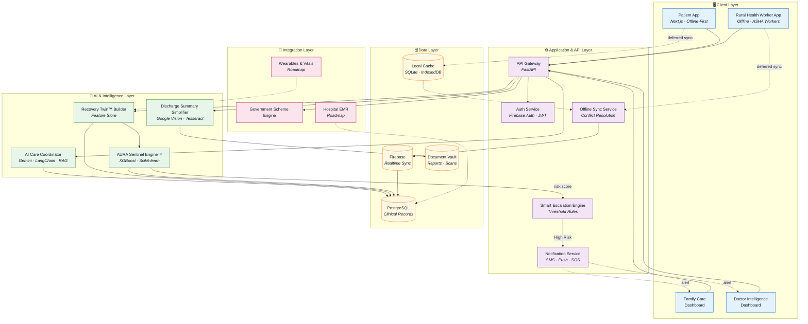

<div align="center">

# AURA CareLink

### AI-Powered Continuity of Care Ecosystem for Rural & Remote Patients

**Powered by AURA Sentinel Engine™**

_Predictive Readmission & Early Relapse Intelligence_


**Team FusionX | Team Code: TETRA007**

_No patient should be forgotten after leaving the hospital._

<br />


_Complete platform overview — workflow, modules, features, architecture & tech stack_

</div>

---

## About the Project

AURA CareLink is an **AI-powered platform that looks after patients once they leave the hospital**. It is built for people in **rural and remote areas**, where follow-up care is hard to get.

For every discharged patient, the platform builds a **Recovery Twin™** — a digital health profile that updates every day. It tracks medicines, symptoms, vitals, activity and follow-up visits.

The **AURA Sentinel Engine™** then studies this data and predicts the **risk of readmission or relapse** before the patient becomes seriously ill. Doctors and caregivers get alerted early, so they can act in time.

The project is being built during the **36-hour TetraTHON 2026 Indo-French Hackathon**. The goal is to keep hospitals and patients connected using **AI, machine learning and offline-first technology**.

---

# The Problem

Millions of patients get sick again after leaving the hospital because they:

- Forget to take their medicines
- Do not understand the discharge instructions
- Miss follow-up appointments
- Cannot reach a doctor in rural areas
- Have nobody checking on their recovery

Because of these gaps, patients end up **back in hospital when it could have been avoided**. Treatment gets delayed and healthcare costs go up.

---

# Our Solution

AURA CareLink brings **patients, caregivers, doctors, hospitals and rural health workers** onto one platform.

The platform:

- Turns discharge summaries into simple language using AI
- Builds a Recovery Twin™ digital health profile for each patient
- Predicts the risk of going back to hospital
- Sends alerts when a patient's condition gets worse
- Works offline for rural health workers
- Answers health questions in the patient's own language

---

# Platform Workflow

The full patient journey, as shown in the [platform overview](AURA%20Carelink%20workflow.jpeg) above:

| Step | Stage                           | What Happens                                                        |
| ---- | ------------------------------- | ------------------------------------------------------------------- |
| 1    | Hospital Discharge              | The patient leaves the hospital with a medical summary               |
| 2    | AI Discharge Summary Simplifier | The report is rewritten in simple words, in the patient's language   |
| 3    | Recovery Profile Creation       | A health profile is created for the patient                          |
| 4    | Recovery Twin™ Dashboard        | The digital recovery profile goes live                               |
| 5    | Daily Monitoring & Check-ins    | The patient adds daily updates — works offline too                   |
| 6    | Data Collection                 | Symptoms, medicines, vitals, activity and follow-ups are recorded    |
| 7    | AURA Sentinel Engine™           | AI models study the patterns in this data                            |
| 8    | Risk Prediction & Analysis      | Readmission risk, recovery score and relapse risk are calculated     |
| 9    | Smart Escalation Engine         | The patient is marked Low, Moderate or High risk                     |
| 10   | Alerts & Notifications          | Doctors and caregivers are alerted if the risk crosses the safe limit |
| 11   | Doctor / Caregiver Action       | A consultation or follow-up is arranged                              |
| 12   | Continuous Recovery & Support   | The cycle repeats until the patient fully recovers                   |

---

# Core Innovations

## Recovery Twin™

A digital health profile built by AI. It updates every day using:

- Symptoms
- Medicines
- Vitals
- Activity
- Follow-up visits attended
- Recovery progress

---

## AURA Sentinel Engine™

The AI engine that predicts:

- Chance of going back to hospital
- Recovery Score
- Chance of an early relapse
- Risk Level (Low / Moderate / High)

---

## AI Discharge Summary Simplifier

Turns difficult medical reports into simple instructions, written in the patient's own language.

Example:

**Medical Report**

```text
Tab Metformin 500mg BID
```

**Patient-Friendly**

```text
Take one tablet after breakfast and one after dinner.
```

---

## Smart Escalation Engine

Automatically alerts doctors and caregivers when a patient's risk crosses a defined threshold.

**Example**

| Stage             | Detail                                                                   |
| ----------------- | ------------------------------------------------------------------------ |
| Signals detected  | Missed medication, fever, breathlessness, low activity, missed follow-up |
| Risk calculated   | Readmission Risk: **89%**                                                |
| Actions triggered | Doctor alerted → Caregiver notified → Emergency consultation recommended |

---

# Platform Modules

| Module                          | What It Does                                        |
| ------------------------------- | --------------------------------------------------- |
| Recovery Twin™                  | Keeps a daily health profile of the patient          |
| AURA Sentinel Engine™           | Predicts readmission and relapse risk                |
| Smart Escalation Engine         | Raises an alert when a patient becomes high risk     |
| AI Care Coordinator             | Answers health questions 24×7 in any language        |
| AI Discharge Summary Simplifier | Rewrites medical reports in simple words             |
| Family Care Dashboard           | Lets family members track recovery and get alerts    |
| Doctor Intelligence Dashboard   | Shows doctors their high-risk patients first         |
| Rural Health Worker Module      | Helps ASHA workers collect data without internet     |
| Government Scheme Navigator     | Helps patients find government health schemes        |
| Offline-First Architecture      | Keeps working when there is no internet              |

---

# Key Features

- Medication Tracker
- Symptom Tracker
- Appointment & Follow-up Manager
- Multilingual Voice Assistant
- Health Education & Recovery Guidance
- Emergency SOS Alerts
- Optional Vitals Monitoring
- Medical Report & Document Vault
- Offline Synchronization
- AI-Based Risk Prediction

---

# How AURA Sentinel Works

### Input Data

- Symptoms
- Medicines
- Vitals
- Medical history
- Follow-up visits attended
- Lifestyle habits

### AI Processing

Machine learning models study the patient's patterns and produce:

- Recovery Score
- Readmission Risk
- Chance of early relapse

### Example Prediction

```text
Patient: Female, 67
Diagnosis: Type-2 Diabetes + Hypertension

Recovery Score: 43%
Readmission Risk: 82%
Medication Adherence: 54%
Follow-up Missed: Yes

Status: HIGH RISK

Recommended Action:
Immediate doctor consultation within 24 hours
Notify caregiver
Schedule emergency follow-up
```

---

# Technology Stack

### Frontend

- Next.js
- React
- Tailwind CSS

### Backend

- FastAPI (Python)

### Database

- SQLite (via SQLAlchemy for local testing)
- PostgreSQL *(Planned)*
- Firebase *(Planned)*

### AI & LLM

- Gemini API *(Planned)*
- LangChain *(Planned)*
- Retrieval-Augmented Generation (RAG) *(Planned)*

### Machine Learning

- XGBoost
- Scikit-learn

### OCR

- Google Vision API *(Planned)*
- Tesseract *(Planned)*

### Authentication

- JWT (JSON Web Tokens)
- Firebase Authentication *(Planned)*

### Deployment

- Vercel (Frontend)
- Docker *(Planned)*
- Render *(Planned)*

---

# System Architecture

AURA CareLink is built in **five layers**. Every app keeps working without internet, and syncs with the cloud once the connection comes back.



### Layer Responsibilities

| Layer                 | What It Handles                                                     | Technologies Used                   |
| --------------------- | ------------------------------------------------------------------- | ----------------------------------- |
| **Client**            | The apps used by patients, families, doctors and health workers      | Next.js, React, Tailwind CSS        |
| **Application & API** | Requests, login, alert rules and offline syncing                     | FastAPI, Firebase Auth, JWT         |
| **AI & Intelligence** | Simplifying reports, answering questions, scoring risk and recovery  | Gemini API, LangChain, RAG, XGBoost |
| **Data**              | Medical records, live updates, documents and offline storage         | PostgreSQL, Firebase, SQLite        |
| **Integration**       | Government schemes now; hospital EMR and wearables later             | REST, Webhooks                      |

> **Note:** Dotted lines in the diagram are background actions — offline syncing, alerts and planned integrations. Solid lines are direct requests.

---

# Repository Structure

```text
TETRA007/
├── frontend/
├── backend/
├── ai/
├── ml-models/
├── docs/
│   ├── images/
│   └── architecture/
├── assets/
├── README.md
└── LICENSE
```

---

# Quick Start

Clone the repository:

```bash
git clone https://github.com/shubham5728/TETRA007.git
cd TETRA007
```

Frontend

```bash
cd frontend
npm install
npm run dev
```

Backend

```bash
cd backend
pip install -r requirements.txt
uvicorn main:app --reload
```

---

# Project Status

**Hackathon Development Prototype**

This project is being developed during the **36-hour TetraTHON 2026 Hackathon**.

### Planned MVP

- AI discharge summary simplification
- Recovery Twin dashboard
- Medication & symptom tracking
- Readmission risk prediction
- Doctor dashboard
- Caregiver dashboard
- Offline synchronization
- Rural health worker support

---

# Impact We Aim to Create

### Patients

- Recover better and faster
- Get guidance made for their own condition
- Feel confident after leaving the hospital

### Caregivers

- See recovery updates as they happen
- Get medicine reminders
- Get alerted in an emergency

### Doctors

- See their high-risk patients first
- Spend less time on manual follow-ups

### Hospitals

- Fewer patients coming back when it could be avoided
- Happier patients
- Better use of hospital resources

### Rural Communities

- Healthcare access even without internet
- Support through ASHA workers and volunteers
- Care reaches remote villages

---

# Future Roadmap

- Support for wearable devices
- Live vitals monitoring
- Connecting with hospital record systems
- Online doctor consultations
- AI-based diet and rehabilitation plans
- Linking with government health records
- Predicting how a disease may progress

---

# Team FusionX (TETRA007)

Built with passion during **TetraTHON 2026**.

- Meet Desai (Team Leader)
- Yash Jakasaniya
- Hit Patel
- Shubham Kumawat

---

# Acknowledgements

This project is being built as part of **TetraTHON 2026**, an Indo-French AI Hackathon for solving real-world problems using AI and technology.

---

<div align="center">

## AURA CareLink

### _We Connect. We Predict. We Protect. We Care._

**Team FusionX | TETRA007 | TetraTHON 2026**

</div>
