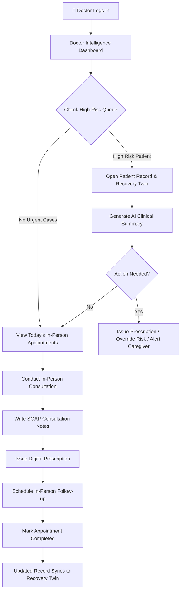
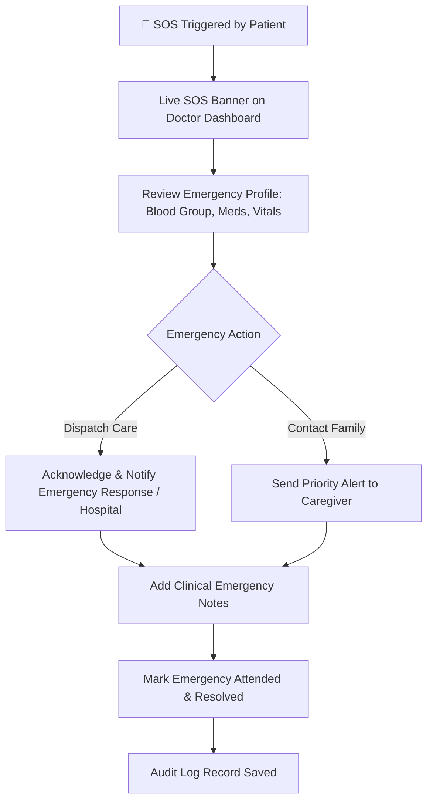

# 🩺 AURA CareLink — Doctor Workflow & Step-by-Step UI Guide

> **Team TETRA007 | TetraTHON 2026 | HealthTech Track**
>
> _This document is the canonical reference for the Doctor role and interactive UI features within the AURA CareLink platform._

---

## Table of Contents

1. [Role Overview](#1-role-overview)
2. [Authentication & Onboarding](#2-authentication--onboarding)
3. [Doctor Intelligence Dashboard UI](#3-doctor-intelligence-dashboard-ui)
4. [Step-by-Step Interactive Features](#4-step-by-step-interactive-features)
   - [Step 1: Patient Triage & Risk Filtering](#step-1-patient-triage--risk-filtering)
   - [Step 2: Patient Record & Recovery Twin Deep-Dive](#step-2-patient-record--recovery-twin-deep-dive)
   - [Step 3: AI Patient Clinical Summary Generation](#step-3-ai-patient-clinical-summary-generation)
   - [Step 4: Interactive Digital Prescription Builder](#step-4-interactive-digital-prescription-builder)
   - [Step 5: SOAP Consultation Notes Management](#step-5-soap-consultation-notes-management)
   - [Step 6: Sentinel Risk Level Override](#step-6-sentinel-risk-level-override)
   - [Step 7: In-Person & Home Visit Appointment Management](#step-7-in-person--home-visit-appointment-management)
   - [Step 8: Emergency SOS Alert Triage & Response](#step-8-emergency-sos-alert-triage--response)
   - [Step 9: Patient & Caregiver Direct Secure Messaging](#step-9-patient--caregiver-direct-secure-messaging)
5. [AURA Sentinel Engine Integration](#5-aura-sentinel-engine-integration)
6. [Notifications & Critical Alerts](#6-notifications--critical-alerts)
7. [Doctor Profile & Settings](#7-doctor-profile--settings)
8. [Access Control & Audit Trail](#8-access-control--audit-trail)
9. [Workflow Diagrams](#9-workflow-diagrams)
10. [Data Entities Involved](#10-data-entities-involved)
11. [Hackathon Priority Checklist](#11-hackathon-priority-checklist)

---

## 1. Role Overview

The **Doctor** is a verified clinical professional on the AURA CareLink platform. Their primary responsibilities are:

| Responsibility              | Description                                                                      |
| --------------------------- | -------------------------------------------------------------------------------- |
| Patient Monitoring          | Track assigned patients' recovery progress, vitals, and Sentinel risk scores     |
| Clinical Decision-Making    | Use AI-generated summaries and Sentinel alerts to prioritise in-person care      |
| Prescription Management     | Issue and manage digital prescriptions with dose & frequency tracking             |
| Emergency Response          | Receive and triage real-time SOS alerts from patients                            |
| Appointment Oversight       | View, confirm, reschedule, and complete in-person/home-visit appointments         |
| Caregiver Coordination      | Communicate with authorised caregivers of their patients                         |
| Sentinel Risk Adjustment     | Review and manually override AI risk levels when clinically indicated            |

---

## 2. Authentication & Onboarding

### 2.1 Registration & Verification

1. Doctor registers with Full Name, Medical Registration Number (MCI / State Council), Specialisation, and Hospital Affiliation.
2. OTP verification sent to registered contact.
3. Hospital Admin approves account verification.
4. Doctor receives credentials and accesses the **Doctor Intelligence Dashboard**.

### 2.2 Secure Session

- Role resolved as `DOCTOR`.
- Automatic session state management via JWT tokens.

---

## 3. Doctor Intelligence Dashboard UI

The UI is built using Next.js, React, and Tailwind CSS. High-risk patients are prioritized at the top of the interface.

```
┌─────────────────────────────────────────────────────────────────────────┐
│   AURA CareLink — Doctor Intelligence Dashboard                         │
├─────────────────┬───────────────────────────────────────────────────────┤
│  Sidebar Nav    │  [ Search Patients... ] [ Filter: High Risk ▾ ] [+New] │
│                 │                                                       │
│  📋 Dashboard   │  ┌─────────────────────────────────────────────────┐  │
│  👥 Patients    │  │ Stat Tiles: Monitored (12) | High Risk (3)      │  │
│  📅 Appointments│  │             Moderate (4)  | Active SOS (1)      │  │
│  💊 Prescribe   │  └─────────────────────────────────────────────────┘  │
│  🚨 Emergency   │                                                       │
│  💬 Messages    │  ┌─────────────────────────────────────────────────┐  │
│  ⚙️ Settings    │  │ Interactive Patient Table / Card View           │  │
│                 │  │ (Sortable by Readmission Risk & Check-in)       │  │
│                 │  └─────────────────────────────────────────────────┘  │
│                 │                                                       │
│                 │  ┌─────────────────────┐   ┌──────────────────────┐   │
│                 │  │ SOS Active Banner   │   │ Quick Prescription   │   │
│                 │  └─────────────────────┘   └──────────────────────┘   │
└─────────────────┴───────────────────────────────────────────────────────┘
```

---

## 4. Step-by-Step Interactive Features

Every feature listed below is fully interactive and functional within the UI:

### Step 1: Patient Triage & Risk Filtering

- **Search Bar**: Live search filtering patients by name, age, or medical condition.
- **Risk Filter Buttons**: Filter view instantly by `All`, `High Risk`, `Moderate Risk`, or `Low Risk`.
- **Dynamic Patient Table**: Displays patient name, age, primary diagnosis, readmission risk bar (0-100%), risk pill badge, and last check-in timestamp.
- **Click-to-Inspect**: Clicking any patient row opens the **Patient Detail Modal**.

### Step 2: Patient Record & Recovery Twin Deep-Dive

- **Recovery Twin Stats**: Displays real-time vitals, medication adherence score (%), recovery progress (0-100), and missed check-ins.
- **Vitals Stream**: Displays blood pressure, pulse rate, oxygen saturation, and temperature logs.
- **Active Medications**: Shows current prescription schedule, dosage, and dose compliance history.

### Step 3: AI Patient Clinical Summary Generation

- **One-Click Generation**: Click `Generate AI Clinical Summary` on any patient profile.
- **AI Sentinel Processing**: Analyzes symptom logs, vitals, missed appointments, and medication compliance.
- **Clinical Output**:
  - Summarizes current health trajectory.
  - Highlights critical risk flags (e.g., missed doses, spiking blood pressure).
  - Provides actionable clinical recommendations for the attending doctor.

### Step 4: Interactive Digital Prescription Builder

- **Trigger**: Click `+ New Prescription` from patient drawer or navigation bar.
- **Form Inputs**:
  - Patient selection dropdown.
  - Drug Name (e.g., Metformin, Amlodipine, Atorvastatin).
  - Dosage (e.g., 500mg, 5mg, 10mg).
  - Frequency (e.g., Once daily, Twice daily after meals).
  - Duration in Days (e.g., 7 days, 14 days, 30 days).
  - Special Instructions (e.g., "Take with food", "Monitor BP daily").
- **Digital Sign & Submit**: Saves prescription to patient record and triggers immediate notification to patient and caregiver.

### Step 5: SOAP Consultation Notes Management

- **Trigger**: Click `Add Consultation Note` after an in-person or home-visit appointment.
- **Structured SOAP Fields**:
  - **Subjective (S)**: Patient reported symptoms and concerns.
  - **Objective (O)**: Clinical observations, vitals, physical examination.
  - **Assessment (A)**: Diagnosis and clinical progress assessment.
  - **Plan (P)**: Medication changes, follow-up date, lifestyle advice.
- **Persistence**: Appends note directly to patient chronological timeline.

### Step 6: Sentinel Risk Level Override

- **Trigger**: Click `Override Sentinel Risk` in Patient Modal.
- **Interactive Controls**: Select manual risk level (`High`, `Moderate`, `Low`).
- **Clinical Reason Input**: Mandatory text box requiring doctor justification for overriding AI prediction.
- **Audit Logging**: Override timestamp, doctor ID, and reason logged immediately.

### Step 7: In-Person & Home Visit Appointment Management

- **Appointment List**: View scheduled in-person clinic appointments, ASHA health worker home visits, and lab checkups.
- **Filter Tabs**: Filter by `Upcoming`, `Confirmed`, `Completed`, or `Missed`.
- **Interactive Actions**:
  - **Confirm**: Confirm slot for in-person visit.
  - **Reschedule**: Propose new visit timestamp.
  - **Mark Complete**: Complete appointment and attach SOAP consultation notes & digital prescription.

### Step 8: Emergency SOS Alert Triage & Response

- **Live SOS Alert Banner**: Displayed prominently at top of dashboard when a patient triggers SOS.
- **Emergency Data Payload**: Patient location coordinates, emergency contact status, blood group, chronic conditions, and current medications.
- **Interactive Action Buttons**:
  - `Acknowledge & Dispatch Ambulance`: Signals emergency coordination center.
  - `Contact Caregiver`: Direct call/message to family member.
  - `Resolve Emergency`: Close alert with resolution notes.

### Step 9: Patient & Caregiver Direct Secure Messaging

- **Trigger**: Click `Send Message` on patient profile or from Messaging tab.
- **Interactive Chat Interface**: Direct 1-on-1 thread between doctor, patient, and verified caregiver.
- **Quick Templates**: One-click messages ("Please take morning dose", "Schedule follow-up visit").

---

## 5. AURA Sentinel Engine Integration

The AURA Sentinel Engine calculates readmission risk and recovery scores using machine learning:

| Metric | Calculation Basis | Clinical Meaning |
|---|---|---|
| **Recovery Score (0-100)** | Daily vitals + symptom stability + activity | Higher = Better recovery |
| **Readmission Risk (%)** | Missed doses + symptom escalation + vitals drift | Higher = Urgency for doctor intervention |
| **Risk Level Badge** | 🟢 Low (<35%) \| 🟡 Moderate (35-74%) \| 🔴 High (≥75%) | Automatic patient queue sorting |

---

## 6. Notifications & Critical Alerts

- **🔴 Critical (SOS Emergency)**: Audio notification + sticky banner + SMS alert.
- **🟡 High Priority (Sentinel Threshold Exceeded)**: Dashboard alert + push notification.
- **🟢 Normal Priority**: Appointment updates, report uploads, message replies.

---

## 7. Doctor Profile & Settings

- **Profile Information**: Name, Specialisation, Medical Registration Number, Clinic Address.
- **Consultation Availability**: Define weekly in-person consultation hours.
- **Alert Thresholds**: Customise sensitivity for Sentinel risk notifications.

---

## 8. Access Control & Audit Trail

- **Role-Based Access Control (RBAC)**: Doctor accesses only assigned patients.
- **Audit Logging**: All record views, prescription issues, risk overrides, and emergency actions are logged with immutable timestamps.

---

## 9. Workflow Diagrams

### 9.1 Daily Doctor Workflow (In-Person & Monitoring)



### 9.2 Emergency SOS Response Flow



---

## 10. Data Entities Involved

- `User`: Base user identity with role `DOCTOR`.
- `Doctor`: Clinical profile, specialisation, registration number.
- `Patient`: Assigned patient data and digital twin.
- `Appointment`: In-person, home visit, or lab appointment record.
- `Prescription`: Medication dosage, frequency, duration, digital signature.
- `MedicalRecord`: Lab reports, discharge summaries, SOAP notes.
- `EmergencyEvent`: SOS trigger, location, status, resolution log.
- `Notification`: System alerts and risk notifications.
- `Message`: Direct messaging thread entries.

---

## 11. Hackathon Priority Checklist

- [x] Doctor Authentication & Session Management
- [x] Filterable & Searchable Doctor Dashboard Queue
- [x] Patient Detail Drawer with Recovery Twin stats
- [x] AI Patient Clinical Summary Generator
- [x] Digital Prescription Builder & Issuer
- [x] SOAP Consultation Notes Form
- [x] Sentinel Risk Level Override Modal
- [x] In-Person & Home-Visit Appointment Manager
- [x] Real-time SOS Alert Banner & Resolution Workflow
- [x] Patient & Caregiver Secure Messaging Interface

---

<div align="center">

## AURA CareLink

### _We Connect. We Predict. We Protect. We Care._

**Team FusionX | TETRA007 | TetraTHON 2026**

</div>
